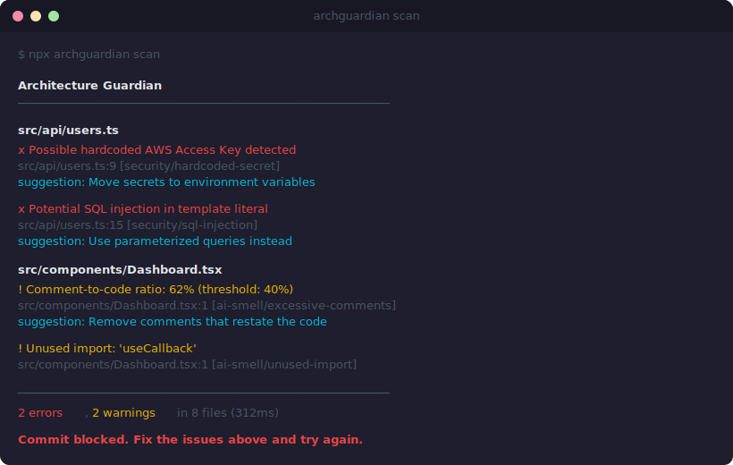
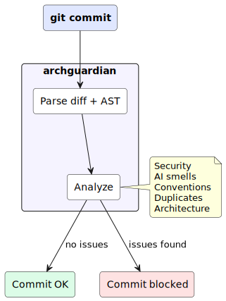

<p align="center">
  
</p>

<h3 align="center">The code quality guardrail for AI-assisted development</h3>

<p align="center">
  <a href="https://www.npmjs.com/package/archguardian"></a>
  <a href="LICENSE"></a>
  <a href="https://nodejs.org"></a>
  
  
</p>

<p align="center">
  <a href="#use-with-ai-coding-tools"></a>
  <a href="#use-with-ai-coding-tools"></a>
  <a href="#use-with-ai-coding-tools"></a>
  <a href="#use-with-ai-coding-tools"></a>
  <a href="#use-with-ai-coding-tools"></a>
  <a href="#use-with-ai-coding-tools"></a>
</p>

<p align="center">
  Cursor, Copilot, Claude Code &mdash; they write code 10x faster.<br>
  <strong>archguardian</strong> makes sure that code doesn't wreck your codebase.
</p>

---

```bash
npx archguardian init    # adds config + git hook — one command, done
npx archguardian scan    # full project scan
npx archguardian fix     # auto-fix findings
git commit               # hook blocks bad code automatically
```

<br>

<p align="center">
  
</p>

<br>

## The problem

You're shipping faster than ever with AI coding tools. But speed without guardrails is how you end up with:

- **Hardcoded API keys** that Copilot autocompleted from training data
- **Unused imports** that Cursor added and never cleaned up
- **`as any` everywhere** because the AI couldn't figure out the types
- **Copy-paste blocks** generated 5 times with slightly different variable names
- **Architecture violations** where the AI imported the database layer directly from UI components
- **Inconsistent naming** across files — `camelCase` here, `snake_case` there, `PascalCase` somewhere else
- **Overly complex functions** with deeply nested conditionals that no one can review
- **Insecure Dockerfiles** running as root with `:latest` tags and exposed secrets

Code review catches some of it. But at 3 PRs a day with 500+ lines of AI-generated code each, reviewers are overwhelmed.

**archguardian catches all of it, automatically, before the commit even happens.**

## How it works

<p align="center">
  
</p>

1. You commit code (written by you, Copilot, Cursor, Claude, or any AI tool)
2. archguardian's pre-commit hook kicks in — analyzes **only changed lines**
3. Real AST parsing via [ast-grep](https://ast-grep.github.io/) (native tree-sitter bindings) — not regex hacks
4. 34 built-in rules across 13 analyzers run in parallel in under 1 second
5. Bad code gets blocked with clear, actionable messages. Clean code passes instantly.

## What it catches

<table>
<tr>
<td valign="top" width="33%">

**Security**
- Hardcoded secrets (AWS, GitHub, Slack, Stripe, Google, JWTs, DB URLs &mdash; 11 patterns)
- SQL injection via template literals
- XSS: `innerHTML`, `dangerouslySetInnerHTML`, `document.write`
- `eval()` / `Function()` usage
- ReDoS-prone regex
- Taint analysis with cross-file tracking
- Custom patterns via config

</td>
<td valign="top" width="33%">

**AI code smells**
- Excessive comment-to-code ratio
- Unused imports (AST-verified, not regex)
- Catch blocks larger than try blocks
- Duplicate code blocks in the same diff
- `as any` type assertions
- Excessive `!` non-null operators

</td>
<td valign="top" width="33%">

**Conventions**
- Functions: `camelCase`
- Classes / interfaces: `PascalCase`
- Constants: `UPPER_SNAKE`
- Files: `kebab-case`
- All configurable per project
- Per-language overrides

</td>
</tr>
<tr>
<td valign="top" width="33%">

**Duplicates**
- AST structural hashing (ignores variable names and literals)
- Jaccard token similarity (configurable threshold)
- Catches the "AI generated 5 similar functions" pattern

</td>
<td valign="top" width="33%">

**Architecture**
- Define layers (UI, Service, Repository, Domain)
- Enforce allowed/denied import directions
- Catches boundary violations at commit time

</td>
<td valign="top" width="33%">

**Complexity**
- Cyclomatic complexity (branch count)
- Cognitive complexity (nesting-weighted)
- Configurable thresholds per project
- Multi-language support

</td>
</tr>
<tr>
<td valign="top" width="33%">

**IaC Security**
- Dockerfile: root user, `:latest` tags, `curl|bash`, exposed secrets, ADD vs COPY, missing HEALTHCHECK
- Kubernetes: privileged containers, missing resource limits, `:latest` image tags
- GitHub Actions: script injection, mutable action references

</td>
<td valign="top" width="33%">

**Dead Code & Coverage**
- Unused export detection via dependency graph
- Test coverage integration (lcov, Istanbul)
- Flags uncovered new/changed code
- Configurable coverage thresholds

</td>
<td valign="top" width="33%">

**Supply Chain**
- Dependency vulnerability scanning (OSV database)
- License compliance checking (allowed/denied lists)
- SBOM generation (CycloneDX 1.5 / SPDX 2.3)
- Structural YAML rules (ast-grep patterns)

</td>
</tr>
</table>

## Works with your stack

TypeScript, JavaScript, TSX, JSX, Python, Go, Rust, Java &mdash; powered by [ast-grep](https://ast-grep.github.io/) native tree-sitter bindings. Real AST parsing, not regex pattern matching.

## Quick start

```bash
# Install and initialize in your project
npx archguardian init
```

That's it. archguardian creates `.archguard.yml` and installs a git pre-commit hook. Every commit is now guarded.

### Configuration

```yaml
version: 1
languages: [typescript, javascript, python, go, rust, java]
include: ["src/**"]
exclude: ["**/*.test.ts", "**/node_modules/**"]

severity:
  failOn: error       # error | warning | info
  maxWarnings: 20

analyzers:
  security:
    enabled: true
    severity: error
  aiSmells:
    enabled: true
    severity: warning
    commentRatio: 0.4
  conventions:
    enabled: true
    naming:
      functions: camelCase
      classes: PascalCase
      constants: UPPER_SNAKE
      files: kebab-case
  duplicates:
    enabled: true
    similarity: 0.85
  architecture:
    layers:
      - name: ui
        patterns: ["src/components/**", "src/pages/**"]
      - name: service
        patterns: ["src/services/**"]
      - name: repository
        patterns: ["src/repositories/**"]
    rules:
      - from: ui
        deny: [repository]
  complexity:
    enabled: true
    severity: warning
    maxCyclomatic: 15
    maxCognitive: 20
  iac:
    enabled: true
    dockerfile: true
    kubernetes: true
    actions: true
  deadCode:
    enabled: true
    entryPoints: ["src/index.ts"]
  coverage:
    enabled: true
    reportPath: "coverage/lcov.info"
    minCoverage: 80
    minNewCodeCoverage: 90
  licenses:
    enabled: true
    allowed: ["MIT", "Apache-2.0", "ISC", "BSD-*"]
    denied: ["GPL-*", "AGPL-*"]
  taint:
    enabled: true
    crossFile: true

# Monorepo workspace overrides
workspaces:
  "packages/api/**":
    analyzers:
      security: { enabled: true, severity: error }
      complexity: { maxCyclomatic: 10 }
  "packages/ui/**":
    analyzers:
      conventions: { severity: warning }

# Structural YAML rules (ast-grep patterns)
rules:
  astgrep: "rules/"   # directory of .yml rule files
```

## Adopting on an existing codebase

Don't want 500 warnings on day one? Use baseline mode:

```bash
archguardian scan --update-baseline      # snapshot current state
archguardian scan                         # only shows NEW findings from now on
```

Findings are matched by `ruleId + file + message` (not line number), so baseline entries survive code edits.

## Inline suppression

Silence false positives without disabling rules globally:

```js
// archguard-ignore security/xss
el.innerHTML = sanitized;                   // suppress specific rule

doSomething(); // archguard-ignore-line     // suppress all rules on this line
```

Works with `//`, `#`, and `/* */` comment styles.

## CLI reference

```
archguardian init                                 Create config + install git hook
archguardian check [--format] [--post-to-pr]      Analyze staged changes (pre-commit)
archguardian scan  [--format] [--post-to-pr]      Analyze full project
archguardian fix   [--dry-run] [--ai]             Auto-fix findings
archguardian learn [--apply]                      Infer conventions from your codebase
archguardian rules [--json]                       List all 34 built-in rules
archguardian metrics [--json]                     Findings trend over time
archguardian dashboard [--port]                   Web dashboard on localhost
archguardian dismiss <ruleId> [--pattern]         Dismiss finding patterns from future scans
archguardian summarize [--format] [--post-to-pr]  Visual change summary with impact diagram
archguardian diagram [--format] [--scope]         Architecture dependency diagram
archguardian sbom [--format cyclonedx|spdx]       Generate Software Bill of Materials
```

Output formats: `terminal` (default), `json`, `sarif`

Exit codes: `0` pass, `1` errors found, `2` warnings exceeded threshold, `3` config error, `4` quality gate failure

## GitHub PR integration

Post findings directly as inline review comments on pull requests:

```bash
archguardian scan --post-to-pr    # posts findings as PR review comments
archguardian summarize --post-to-pr  # posts summary as PR comment
```

Requires `GITHUB_TOKEN`, `GITHUB_REPOSITORY`, and `GITHUB_PR_NUMBER` environment variables (auto-set in GitHub Actions).

## SBOM generation

Generate a Software Bill of Materials for compliance and supply chain security:

```bash
archguardian sbom --format cyclonedx > sbom.json   # CycloneDX 1.5
archguardian sbom --format spdx > sbom.json         # SPDX 2.3
```

Collects dependencies from `package.json`, `go.mod`, `Cargo.toml`, and `pom.xml`. Outputs include PURLs for each component.

## Use with AI coding tools

archguardian ships with ready-made slash commands for all major AI coding assistants. After `npx archguardian init`, just type `/scan`, `/fix`, or `/check` in your AI tool.

| Command | What it does |
|:--------|:-------------|
| `/scan` | Full project scan, findings grouped by severity |
| `/check` | Analyze staged changes before committing |
| `/fix` | Auto-fix unused imports and naming violations |
| `/baseline` | Snapshot current findings for incremental adoption |
| `/suppress` | Add inline suppression comments for false positives |
| `/setup` | Initialize archguardian in a new project |
| `/complexity` | Analyze cyclomatic and cognitive complexity |
| `/dead-code` | Detect unused exports and dead code |
| `/sbom` | Generate Software Bill of Materials |
| `/iac` | Scan Dockerfiles, Kubernetes, GitHub Actions |
| `/licenses` | Check dependency license compliance |
| `/coverage` | Integrate test coverage reports |

### Claude Code

archguardian includes [skills](https://code.claude.com/docs/en/skills) (`.claude/skills/`) that register as slash commands automatically.

```
.claude/skills/
├── scan/SKILL.md        →  /scan
├── check/SKILL.md       →  /check
├── fix/SKILL.md         →  /fix
├── baseline/SKILL.md    →  /baseline
├── suppress/SKILL.md    →  /suppress
├── setup/SKILL.md       →  /setup
├── complexity/SKILL.md  →  /complexity
├── dead-code/SKILL.md   →  /dead-code
├── sbom/SKILL.md        →  /sbom
├── iac/SKILL.md         →  /iac
├── licenses/SKILL.md    →  /licenses
└── coverage/SKILL.md    →  /coverage
```

**How it works:** Clone or install archguardian, and the skills are available immediately. Type `/scan` in Claude Code and it runs `npx archguardian scan --format json`, parses findings, explains each one, and offers to fix or suppress.

Skills use [SKILL.md frontmatter](https://code.claude.com/docs/en/skills#frontmatter-reference) with `allowed-tools`, `$ARGUMENTS` substitution, and `description` fields so Claude can also invoke them automatically when relevant.

### Cursor

archguardian includes both [rules](https://docs.cursor.com/context/rules) (`.cursor/rules/`) for background context and [slash commands](https://docs.cursor.com/chat/custom-commands) (`.cursor/commands/`) for invocable actions.

```
.cursor/
├── rules/
│   ├── archguardian.mdc    # Always-on project context
│   └── ...                  # Agent-requested contexts
└── commands/
    ├── scan.md              →  /scan
    ├── check.md             →  /check
    ├── fix.md               →  /fix
    ├── complexity.md        →  /complexity
    ├── dead-code.md         →  /dead-code
    ├── sbom.md              →  /sbom
    ├── iac.md               →  /iac
    ├── licenses.md          →  /licenses
    └── coverage.md          →  /coverage
```

Type `/scan` in Cursor Agent chat to run a full project scan.

### GitHub Copilot

archguardian includes [prompt files](https://code.visualstudio.com/docs/copilot/customization/prompt-files) (`.github/prompts/`) that register as slash commands in VS Code.

```
.github/
├── copilot-instructions.md      # Always-on project context
└── prompts/
    ├── scan.prompt.md            →  /scan
    ├── check.prompt.md           →  /check
    ├── fix.prompt.md             →  /fix
    ├── complexity.prompt.md      →  /complexity
    ├── iac.prompt.md             →  /iac
    └── ...
```

Type `/scan` in Copilot Chat to run a full project scan.

### Windsurf

archguardian includes [workflows](https://docs.windsurf.com/windsurf/cascade/workflows) (`.windsurf/workflows/`) and [rules](https://docs.windsurf.com/windsurf/cascade/rules) (`.windsurf/rules/`).

```
.windsurf/
├── rules/
│   └── rules.md                 # Always-on project context
└── workflows/
    ├── scan.md                   →  /scan
    ├── check.md                  →  /check
    ├── fix.md                    →  /fix
    ├── complexity.md             →  /complexity
    ├── iac.md                    →  /iac
    └── ...
```

Type `/scan` in Windsurf Cascade to run a full project scan.

### Cline

archguardian includes [rules](https://docs.cline.bot/features/cline-rules) (`.clinerules/`) for project context. Cline also auto-detects the `.cursor/rules/` files.

### Aider

archguardian works with Aider via the `.aider.conf.yml` config which loads `CLAUDE.md` as read-only context:

```yaml
read:
  - CLAUDE.md
```

> **Tip**: All commands use `--format json` under the hood. JSON output is structured and easier for AI tools to parse, explain, and act on.

## CI/CD

### GitHub Action

```yaml
- uses: ysfAskri/archguardian@v1
  with:
    format: sarif           # uploads to GitHub Security tab
    quality-gate: true      # enforce quality thresholds
    post-to-pr: true        # post findings as inline PR comments
```

### Any CI

```bash
npx archguardian scan --format sarif > results.sarif
npx archguardian scan --post-to-pr    # inline PR review comments
npx archguardian sbom --format cyclonedx > sbom.json
```

## VS Code Extension

The `vscode-extension/` directory contains a VS Code extension with:

- Inline diagnostics for all archguardian findings
- Code actions: quick-fix with AI and inline suppression
- Auto-scan on file save
- Status bar showing finding count

## LLM-powered suggestions

Get AI-powered fix suggestions for findings. Supports OpenAI, Anthropic, and Gemini:

```yaml
llm:
  enabled: true
  provider: anthropic   # openai | anthropic | gemini
```

Set your API key via `OPENAI_API_KEY`, `ANTHROPIC_API_KEY`, or `GEMINI_API_KEY`. Responses are cached locally to avoid repeated API calls.

## Plugins

Extend with custom analyzers:

```yaml
plugins:
  - archguardian-plugin-my-rules
```

Each plugin exports an analyzer class. See [plugin docs](docs/) for details.

## Structural YAML rules

Define custom rules using ast-grep patterns in YAML files:

```yaml
# rules/no-console-log.yml
id: no-console-log
language: typescript
rule: "console.log($$$ARGS)"
message: "Avoid console.log in production code"
severity: warning
```

```yaml
# .archguard.yml
rules:
  astgrep: "rules/"
```

## How it compares

archguardian is not a replacement for ESLint or SonarQube. It solves a different problem: **catching the patterns AI coding tools introduce**, with zero setup friction.

| | archguardian | ESLint | SonarQube | CodeRabbit | Semgrep |
|:---|:---:|:---:|:---:|:---:|:---:|
| AI-specific code smells | **Built-in** | Partial | No | No | No |
| Architecture enforcement | **Built-in** | Via plugin | Paid only | No | No |
| Complexity metrics | **Built-in** | Via plugin | Built-in | No | No |
| IaC security scanning | **Built-in** | No | No | No | Via rules |
| Dead code detection | **Built-in** | Via plugin | Built-in | No | No |
| SBOM generation | **Built-in** | No | No | No | No |
| License compliance | **Built-in** | No | Paid only | No | No |
| Coverage integration | **Built-in** | No | Built-in | No | No |
| Cross-file taint analysis | **Built-in** | No | Paid only | No | Built-in |
| PR inline review bot | **Built-in** | No | Via plugin | Built-in | Via app |
| Monorepo workspaces | **Built-in** | Via config | Built-in | Built-in | Via config |
| Pre-commit hook | **One command** | Manual | No | No | Built-in |
| Speed on typical diffs | **< 1 second** | 1-5s | Minutes | N/A | 1-5s |
| Languages | 8 | JS/TS core | 20+ | Many | 30+ |
| AI tool integrations | **6 tools** | None | SonarLint | GitHub | None |
| Pricing | Free (MIT) | Free (MIT) | Freemium | Freemium | Freemium |

**Use archguardian when** you want a fast, zero-config guardrail purpose-built for AI-assisted development.
**Use ESLint when** you need deep JavaScript/TypeScript linting with hundreds of configurable rules.
**Use SonarQube when** you need enterprise-grade code quality across a large org with dashboards, quality gates, and compliance reporting.
They work well together — archguardian catches what the others miss in the pre-commit stage.

## Contributing

```bash
git clone https://github.com/ysfAskri/archguardian.git
cd archguardian && npm install
npm test           # 273 tests
npm run build      # builds to dist/
```

<details>
<summary>Project structure</summary>

```
src/
├── cli/          Commander.js entry + 12 commands + output formatters (terminal, JSON, SARIF)
├── core/         Pipeline, config loader, diff parser, suppression, baseline, workspace resolver, dependency collector, types
├── parsers/      ast-grep NAPI parser (TS/JS/Python/Go/Rust/Java) + AST utilities
├── analyzers/    Security, AI smells, conventions, duplicates, layer violations, complexity, IaC, dead code, coverage, licenses, taint (cross-file), structural rules
├── plugins/      Dynamic plugin loader for external analyzers
├── llm/          LLM client (OpenAI, Anthropic, Gemini), prompt builder, file-based cache
├── fixes/        Auto-fix engine (remove unused imports, rename conventions, AI-powered)
├── metrics/      Run history tracker (.archguard/metrics.json)
├── hooks/        Git hook installer (direct + Husky)
├── ci/           GitHub annotator + PR review bot + PR summary commenter
└── utils/        Git operations, logging, perf timing
```

</details>

## License

[MIT](LICENSE)

---

<p align="center">
  <sub>Built by <a href="https://github.com/ysfAskri">Youssef ASKRI</a></sub>
</p>
